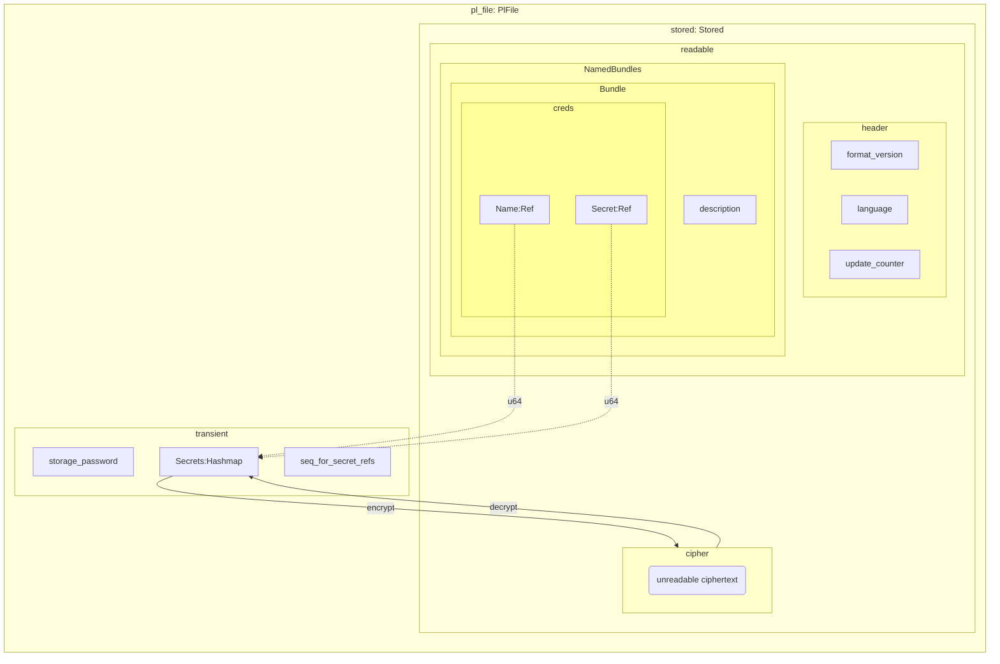
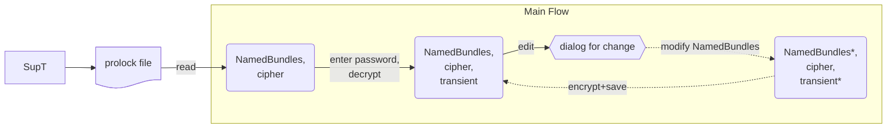

# Prolock

## Data structures

```mermaid
    flowchart LR

    subgraph pl_file: PlFile
        subgraph stored: Stored
            subgraph readable
                subgraph header
                    format_version
                    language
                    update_counter
                end

                subgraph NamedBundles
                    subgraph Bundle
                        description
                        subgraph creds
                         Name:Ref
                         Secret:Ref
                        end
                    end
                end
            end
            subgraph cipher
                C(unreadable ciphertext)
            end
        end

        subgraph transient
            storage_password
            seq_for_secret_refs
            Secrets:Hashmap
        end
    end


    Name:Ref -. u64 .-> Secrets:Hashmap
    Secret:Ref -. u64 .-> Secrets:Hashmap
    Secrets:Hashmap -- encrypt --> cipher
    cipher -- decrypt --> Secrets:Hashmap


classDef class1 fill:#ffc;
classDef class2 fill:#ffb;
classDef class3 fill:#ffa;
classDef class4 fill:#ff9;
class readable,cipher class1
class NamedBundles,header class2
class Bundle class3
class creds class4
```

## Main flow

```mermaid
flowchart LR

FILE@{ shape: doc, label: "prolock file" } -- read --> S(NamedBundles, 
cipher)

subgraph Main Flow
    direction RL
    S -- enter password,
    decrypt --> ST(NamedBundles, 
    cipher, 
    transient)
    ST -- edit --> UI{{dialog for change}}
    UI -. modify NamedBundles .-> SmodT(NamedBundles*, 
    cipher, 
    transient*)
    SmodT -. encrypt+save .-> ST
end
SupT --> FILE
```
