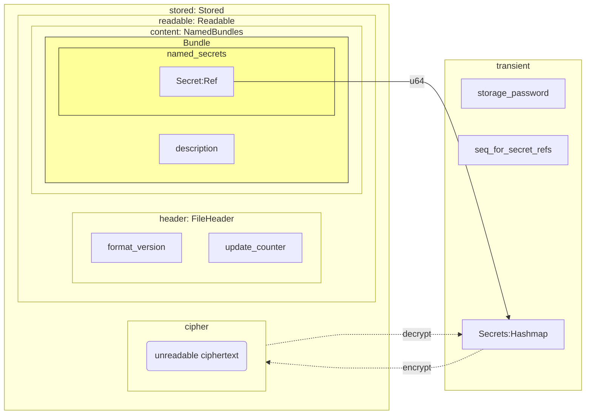
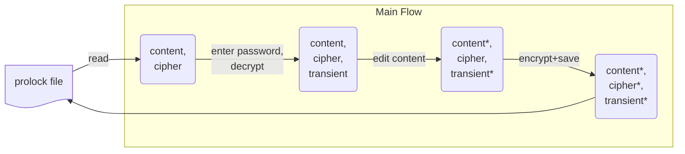

# Prolock

## Data structures

    PlFile
        - stored: Stored
            * readable: Readable
                * header: FileHeader
                    * format_version: u8
                    * update_counter: Sequence<usize>
                * content: Bundles
                    * Bundles: BTreeMap<String, Bundle>
                        * Bundle
                            * description: String,
                            * named_secrets: BTreeMap<String, Secret>,
                                * enum Secret{New(String), Ref(u64)}
            * cipher: String
        - o_transient: Option<Transient>
            * storage_password: SecUtf8
            * seq_for_secret_refs: Sequence<u64>
            * secrets: Secrets(HashMap<u64, String>)

## Main flow

